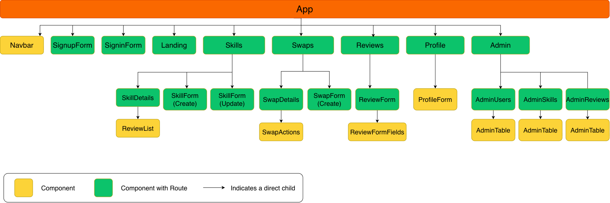

# swaply-backend

## User Stories

### Guest User Stories

* As a guest, I can view the home page explaining how skill swap works.
* As a guest, I can browse available skills.
* As a guest, I can search for skills.
* As a guest, I can filter skills by category.
* As a guest, I can view the details of a specific skill.
* As a guest, I can view other users' profiles.
* As a guest, I can sign up for an account.
* As a guest, I can log in to my account.

### General User Stories

* As a user, I can log in to my account.
* As a user, I can log out of my account.
* As a user, I can view and edit my profile.
* As a user, I can add a skill that I can teach.
* As a user, I can view available skills.
* As a user, I can search for skills I want to learn.
* As a user, I can filter skills by category.
* As a user, I can view the details of a skill.
* As a user, I can edit my own skills.
* As a user, I can delete my own skills.
* As a user, I can send a skill swap request to another user.
* As a user, I can view my swap requests.
* As a user, I can view the details of a swap.
* As a user, I can accept a swap request.
* As a user, I can reject a swap request.
* As a user, I can cancel a swap request.
* As a user, I can mark a swap as completed.
* As a user, I can leave a review after completing a swap.
* As a user, I can view reviews.
* As a user, I can edit my own review.
* As a user, I can delete my own review.

### Admin User Stories

* As an admin, I can access an admin dashboard.
* As an admin, I can view platform statistics.
* As an admin, I can view all users.
* As an admin, I can delete a user account.
* As an admin, I can view all skills.
* As an admin, I can delete an inappropriate skill.
* As an admin, I can view all swap requests.
* As an admin, I can view all reviews.
* As an admin, I can delete an inappropriate review.
---

## ERD

---

## Wireframes

---

## Routes

### Auth Routes

| **HTTP Method** | **Controller** | **Response** | **URI**        | **Use Case**                  |
| --------------- | -------------- | -----------: | -------------- | ----------------------------- |
| POST            | signup         |          201 | `/auth/signup` | Create a new user account     |
| POST            | login          |          200 | `/auth/login`  | Login with email and password |

### User Routes

| **HTTP Method** | **Controller** | **Response** | **URI**          | **Use Case**             |
| --------------- | -------------- | -----------: | ---------------- | ------------------------ |
| GET             | getUser        |          200 | `/users/profile` | Get current user profile |
| PUT             | updateUser     |          200 | `/users/profile` | Update user profile      |
| DELETE          | deleteUser     |          200 | `/users/profile` | Delete user account      |

### Skill Routes

| **HTTP Method** | **Controller** | **Response** | **URI**            | **Use Case**              |
| --------------- | -------------- | -----------: | ------------------ | ------------------------- |
| POST            | createSkill    |          201 | `/skills`          | Create a new skill        |
| GET             | getSkills      |          200 | `/skills`          | List all available skills |
| GET             | showSkill      |          200 | `/skills/:skillId` | Get a single skill        |
| PUT             | updateSkill    |          200 | `/skills/:skillId` | Update a skill            |
| DELETE          | deleteSkill    |          200 | `/skills/:skillId` | Delete a skill            |

### Swap Routes

| **HTTP Method** | **Controller** | **Response** | **URI**          | **Use Case**                  |
| --------------- | -------------- | -----------: | ---------------- | ----------------------------- |
| POST            | createSwap     |          201 | `/swaps`         | Send a new skill swap request |
| GET             | getSwaps       |          200 | `/swaps`         | List user's swap requests     |
| GET             | showSwap       |          200 | `/swaps/:swapId` | Get a single swap             |
| PUT             | updateSwap     |          200 | `/swaps/:swapId` | Update swap status            |
| DELETE          | deleteSwap     |          200 | `/swaps/:swapId` | Cancel a swap request         |

### Review Routes

| **HTTP Method** | **Controller** | **Response** | **URI**              | **Use Case**                 |
| --------------- | -------------- | -----------: | -------------------- | ---------------------------- |
| POST            | createReview   |          201 | `/reviews`           | Create a review after a swap |
| GET             | getReviews     |          200 | `/reviews`           | List reviews                 |
| GET             | showReview     |          200 | `/reviews/:reviewId` | Get a single review          |
| PUT             | updateReview   |          200 | `/reviews/:reviewId` | Update a review              |
| DELETE          | deleteReview   |          200 | `/reviews/:reviewId` | Delete a review              |

### Admin Routes

| **HTTP Method** | **Controller** | **Response** | **URI**                    | **Use Case**                   |
| --------------- | -------------- | -----------: | -------------------------- | ------------------------------ |
| GET             | dashboard      |          200 | `/admin/dashboard`         | View platform statistics       |
| GET             | getUsers       |          200 | `/admin/users`             | List all users                 |
| GET             | getSkills      |          200 | `/admin/skills`            | List all skills                |
| GET             | getSwaps       |          200 | `/admin/swaps`             | List all swap requests         |
| GET             | getReviews     |          200 | `/admin/reviews`           | List all reviews               |
| DELETE          | deleteUser     |          200 | `/admin/users/:userId`     | Delete a user account          |
| DELETE          | deleteSkill    |          200 | `/admin/skills/:skillId`   | Delete an inappropriate skill  |
| DELETE          | deleteReview   |          200 | `/admin/reviews/:reviewId` | Delete an inappropriate review |

## Component Hierarchy Diagram

